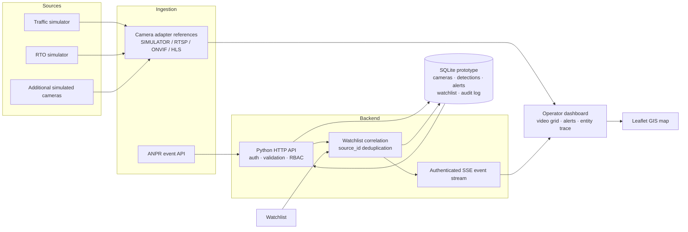
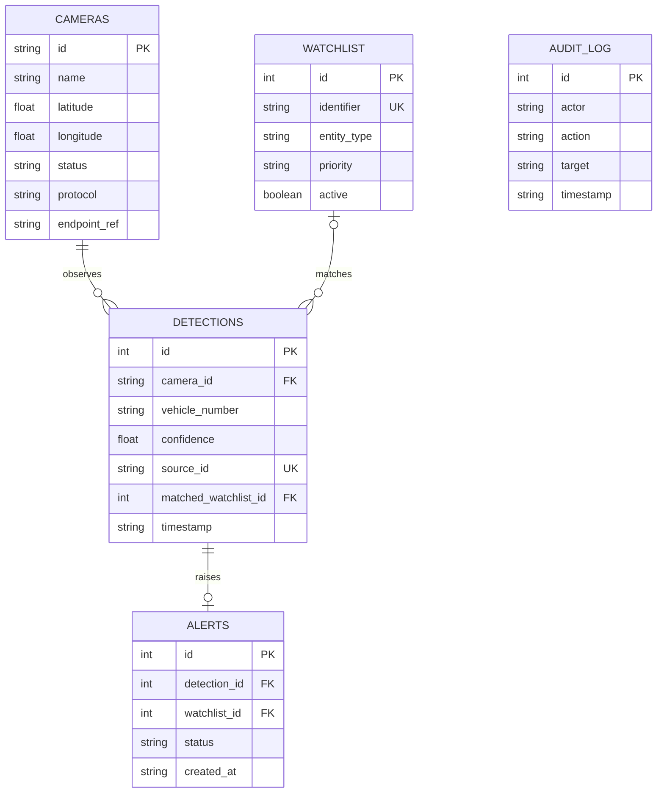

# okDriver Sentinel — CCTV and Video Analytics Prototype

A local, working prototype for the okDriver full stack hiring assignment. It demonstrates a unified camera registry, simulated near-live camera views, ANPR event ingestion, watchlist correlation, immediate operator alerts, audit history, and vehicle movement search.

> **Demo data only.** Camera scenes, plate identifiers, and watchlist records are synthetic. This is not a production VMS or an operational law-enforcement tool.

## Run locally

Requirements: Python 3.9 or newer and Node.js 20 or newer for the React dashboard. The API uses only the Python standard library.

```powershell
Copy-Item .env.example .env
notepad .env
Set-Location frontend
npm ci
npm run build
Set-Location ..
python server.py
```

Before starting the server, replace all three `REPLACE_WITH_...` values in `.env` with two unique passwords (at least 12 characters each) and a random signing key (at least 32 characters). These local secrets are read by the server but `.env` is excluded from Git. The server refuses to start while the template values remain. Open <http://127.0.0.1:8000>. The first run creates `data/okdriver.sqlite3`, migrates older assignment databases in place, and seeds synthetic cameras across eight city centers plus sample watchlist records and sightings. The seeded `GJ01AB1234` record appears at several Ahmedabad cameras so route tracing and the alert center have data immediately.

Local demo usernames:

The usernames are `admin`, `operator`, `operator.surat`, `operator.vadodara`, `operator.rajkot`, `operator.gandhinagar`, `operator.jaipur`, `operator.mumbai`, and `operator.bhopal`. The admin password is the value of `OKDRIVER_ADMIN_PASSWORD`; all operator accounts use `OKDRIVER_OPERATOR_PASSWORD`. Password values are intentionally never listed in this repository. `OKDRIVER_TOKEN_KEY` signs sessions and should be a long random value.

Operators can access their assigned command center and own newly ingested events/alerts, plus unowned synthetic seed records. Audit views show admin/system actions and that operator�s actions. Admin can choose a city or **All Command Centers** and sees all audit records. Demo operator accounts share the password controlled by `OKDRIVER_OPERATOR_PASSWORD`.

### React development

Run the Python API in one terminal, then start Vite in another:

```powershell
cd frontend
npm install
npm run dev
```

Open <http://127.0.0.1:5173>. Vite proxies `/api` calls to Python. For the one-port version, run `npm run build` inside `frontend`, then `python server.py`; the API serves `frontend/dist` at <http://127.0.0.1:8000>.

### Docker Compose

With Docker Desktop installed, create and edit `.env` as described above, then run:

```powershell
docker compose up --build
```

The service is available at <http://127.0.0.1:8000>. SQLite data persists in the named `sentinel-data` volume. For a shared demo, create an untracked `.env` file from `.env.example` and replace its placeholder values before starting Compose.

## Features implemented

- Camera registry: seeded examples plus manual and API onboarding, editing, health status changes, search, status filter, last heartbeat, zone, protocol and storage metadata.
- Multiple camera source representation: separate simulator endpoints and adapter references for a traffic junction, RTO checkpoint, riverfront entrance, and Maninagar circle.
- Near-live monitoring: animated synthetic road scenes for online and degraded simulator cameras; offline sources visibly report no signal.
- GIS: Leaflet camera markers colored by health, OpenStreetMap background tiles, and chronological vehicle route plotting when multiple camera detections exist.
- Analytics ingestion: validated ANPR event API, confidence bounds, camera ID validation, persistence, bounding box, and unique `source_id` duplicate suppression.
- Watchlist: synthetic vehicle/person identifiers, add and enable/disable operations, active/inactive/all filters, and exact matching only against active identifiers. Disabling an entry preserves it and its historical alerts in SQLite; current summaries default to active identifiers.
- Alert workflow: watchlist matches create persisted alerts and push them to connected dashboards; operators can acknowledge or resolve them.
- Real-time updates: authenticated, center- and owner-scoped Server-Sent Events (SSE) refresh dashboard data in every open session after detections, alerts, camera changes, or watchlist changes.
- Entity lookup: vehicle number search returns ordered camera sightings and coordinates.
- Full entity directory: lists every distinct vehicle number with a saved detection, event count, first/last sighting, and latest camera; exact-plate tracing returns the complete chronological history for that vehicle. Partial searches show candidates without mixing different vehicles into one route.
- Dedicated operator sections: Detection history, Vehicle tracking, Alert center, and Audit log are available from the left navigation alongside Overview, Camera registry, and Watchlist.
- Audit history: camera changes, heartbeats, detection ingestion, watchlist changes, and alert actions are recorded.
- Camera health monitor: simulator sources refresh their heartbeat; an external RTSP/ONVIF/HLS source that misses heartbeats for 90 seconds is marked Offline and audited.
- Authentication: seeded demo accounts with salted scrypt password hashes, bearer tokens, and administrator/operator role checks.
- React dashboard with Tailwind CSS, responsive navigation, command-center selection, and an explicit add-identifier modal.
- Alert center separates the four most recent unique vehicle alerts from filterable history. Selecting a vehicle fills the search; Trace fills an exact vehicle search, scrolls to the map, and numbers each sighting and pin chronologically.
- Eight city command centers, a multi-center admin view, and command-center scoped operator accounts.

## Architecture



The feed panels render local synthetic scenes in canvas; they do not connect to actual cameras. Endpoint references are metadata only in this prototype. A production adapter should retrieve RTSP credentials from a secrets manager, ingest through an isolated video gateway, and provide browser-compatible WebRTC/HLS playback.

## API overview

Except `POST /api/login` and `GET /api/health`, endpoints require `Authorization: Bearer <token>`. JSON request and response bodies are used. Login tokens last eight hours.

| Method | Path | Purpose |
| --- | --- | --- |
| `GET` | `/api/health` | Liveness and demo mode |
| `POST` | `/api/login` | Authenticate `admin` or `operator` |
| `GET` | `/api/bootstrap` | Dashboard's cameras, events, alerts, watchlist and audit snapshot |
| `GET` | `/api/cameras?q=&status=` | Search/filter registry |
| `POST` | `/api/cameras` | Add camera (admin) |
| `PATCH` | `/api/cameras/{camera_id}` | Edit camera (admin) |
| `POST` | `/api/cameras/{camera_id}/heartbeat` | Update camera health and heartbeat timestamp |
| `POST` | `/api/events` | Ingest an ANPR analytics event, correlate watchlist, and create alert if matched |
| `GET` | `/api/entities` | List all distinct detected vehicles, with counts and last-seen metadata |
| `GET` | `/api/entities/search?q={identifier}&exact=true` | Return all exact-plate sightings, oldest first; omit `exact=true` for partial search |
| `GET` | `/api/events?q=&camera_id=&limit=` | Browse persisted event history (up to 1,000 rows per request) |
| `GET` | `/api/alerts` | List alerts |
| `PATCH` | `/api/alerts/{alert_id}` | Set status to `Acknowledged` or `Resolved` |
| `GET` | `/api/watchlist` | List watchlist |
| `POST` | `/api/watchlist` | Add identifier (admin) |
| `PATCH` | `/api/watchlist/{id}` | Set `active: true/false` (admin) |
| `GET` | `/api/events/stream` | Authenticated SSE updates |

Example event:

```json
{
  "camera_id": "C001",
  "timestamp": "2026-09-26T10:30:00Z",
  "vehicle_number": "GJ01AB1234",
  "confidence": 0.96,
  "vehicle_type": "Car",
  "event_type": "ANPR",
  "bounding_box": {"x": 0.34, "y": 0.46, "width": 0.2, "height": 0.14},
  "source_id": "anpr-worker-01-frame-0000123"
}
```

`source_id` must uniquely identify the source inference event. Repeated IDs return HTTP 409, preventing duplicate alerts. A successful response contains the stored event, a matching alert (or `null`), and `watchlist_match`.

## Database schema

SQLite tables: `users`, `command_centers`, `user_command_centers`, `cameras`, `watchlist`, `detections`, `alerts`, and `audit_log`. Membership models the user-to-center many-to-many relationship. Detections and alerts record their owning user; cameras are assigned to a center; audits record actor role and center. Detections retain foreign keys to cameras and watchlist matches, alerts have a unique `detection_id`, and source IDs are unique. Indexes cover vehicle/time and camera/time. Startup migrations add columns without replacing existing records. See `initialize()` in [server.py](server.py).



## Configuration

| Variable | Default | Notes |
| --- | --- | --- |
| `HOST` | `127.0.0.1` | Bind address. Keep localhost unless intentionally exposing the demo. |
| `PORT` | `8000` | HTTP port. |
| `OKDRIVER_DB` | `./data/okdriver.sqlite3` | SQLite file location. |
| `OKDRIVER_ADMIN_PASSWORD` | Required in `.env` | Unique local admin password (12+ characters). |
| `OKDRIVER_OPERATOR_PASSWORD` | Required in `.env` | Unique local operator password (12+ characters). |
| `OKDRIVER_TOKEN_KEY` | Required in `.env` | Long random signing key. |
| `OKDRIVER_DEMO_MODE` | `true` | Liveness response indicator. |

`SIMULATOR` sources refresh their heartbeat every 15 seconds. Non-simulator sources transition to Offline when the last heartbeat is over 90 seconds old. A source integration should call its heartbeat endpoint at an interval shorter than the timeout.

PowerShell example:

```powershell
$env:OKDRIVER_ADMIN_PASSWORD = "use-a-unique-local-password"
$env:OKDRIVER_OPERATOR_PASSWORD = "use-another-unique-password"
$env:OKDRIVER_TOKEN_KEY = "replace-with-a-long-random-secret"
python server.py
```

No credentials or API keys are stored in the repository. Do not put passwords in stream endpoint references; use secret references in a production adapter.

## Demo walkthrough (3–5 minutes)

1. Sign in as admin and show the live system status, synthetic camera grid, and map.
2. Open Camera registry, add a simulator camera, edit its metadata or set its status to Degraded, and show the map/health update.
3. Open **Vehicle tracking** and trace `GJ01AB1234`; its seeded detections at three cameras demonstrate a chronological route. The vehicle directory also lists every other plate present in stored detections.
4. Open **Alert center**, acknowledge or resolve a sample match, then open Watchlist to add or disable a synthetic identifier.
5. Click **Generate detection**. A new random plate event enters through the API; a matching sample plate creates an immediate alert visible in the live dashboard.
6. Use **Simulate detection** on Overview to create and persist a random ANPR event; an active watchlist match also creates an alert. Open **Detection history** and **Audit log** to show records, then mention `POST /api/events`, SQLite persistence, SSE, duplicate suppression, and the scale-up plan below.

The assignment asks the candidate to record and submit a 3–5 minute screen recording. This repository includes the walkthrough, but a recording and hosted deployment still need to be made by the candidate.

## Scalability and production path

This prototype intentionally uses one Python process and SQLite. For a larger installation, separate camera control-plane data from high-volume video and event ingestion:

- **Regional and edge compute:** deploy gateways near camera clusters; perform motion filtering/ANPR locally and forward metadata plus only relevant clips. Keep gateways on segmented camera networks and expose an outbound authenticated channel.
- **Video and bandwidth:** relay RTSP/ONVIF sources through regional media servers to WebRTC for interactive low-latency viewing or HLS for broad distribution. Offer selectable resolution, adaptive bitrate, substreams, and event-triggered clip upload. Do not proxy 80,000 raw feeds through the API service.
- **Services and scaling:** put stateless API and SSE/WebSocket workers behind a load balancer; use a durable broker (Kafka for high-throughput replay, or RabbitMQ for simpler routing) between adapters, analytics, correlation, and alert delivery. Redis can hold short-lived camera health and presence state.
- **Storage:** use PostgreSQL/MySQL with indexes and time partitioning for metadata, object storage for clips, and retention tiers for hot, warm, and cold footage. Define retention by policy and jurisdiction; avoid storing more video than required.
- **Analytics compute:** benchmark per-camera frame rates and model accuracy before sizing GPUs. Run batching and model placement at regional/edge sites; reserve central GPUs for heavier re-identification or batch work. Scale workers from queue lag and camera health.
- **Reliability and operations:** deploy multiple API/broker/database replicas across failure zones, backups with restore drills, monitoring and alerting for ingest lag, dropped frames, stream failures, storage, and database saturation. Add request IDs, structured logs, metrics, and disaster-recovery objectives.
- **Security:** use TLS, managed identities and secret storage, short-lived scoped credentials, strong RBAC and tenant isolation, network allowlists, signed audit trails, rate limits, encryption at rest, retention controls, vulnerability scans, and operator access reviews.
- **Infrastructure and cost estimation:** derive cost from camera counts per region, concurrent viewers, encoded bitrate, retention days, event rate, analytics FPS/model, and availability target. Price media egress, object storage, GPU-hours, managed databases, broker throughput, and regional redundancy from the selected cloud provider's calculator. There is not enough workload information in this assignment to claim a reliable rupee estimate; load tests and camera/feed profiles should precede procurement.

## Known limitations

- Simulator scenes are animated canvas artwork, not recorded CCTV, a real stream, or an AI model. Click the detection control or post an inference result to demonstrate analytics.
- API auth uses seeded demo accounts with salted scrypt password hashes and in-memory signed tokens; sessions do not survive server restarts without a fixed token key. There is no refresh/revocation, CSRF boundary, rate limiter, or TLS termination.
- The single process, SQLite database, and in-memory SSE fan-out do not scale horizontally. SSE reconnect does not replay missed events; persisted state is refreshed on initial load.
- The detection-history screen currently loads up to 1,000 rows at once; add pagination before using it with high-volume data. The entity directory returns all distinct plates and should also use pagination for a large deployment.
- Heartbeat timeout is fixed at 90 seconds in this prototype and should be configurable per source in a production service.
- The map depends on externally hosted Leaflet, fonts, and OpenStreetMap tiles; a network connection is required for map styling and tiles. The rest of the interface and APIs are served locally.
- No real camera discovery, video relay, AI inference worker, cross-camera identity model, HTTPS, or automated test suite is included.

## Reference

The assignment's official hackathon reference is [Gujarat Police Innovation Hackathon — problem statements](https://sentinel.gujarat.gov.in/problems). It could not be opened from the authoring environment; this implementation uses the technical requirements reproduced in the supplied assignment PDF.
